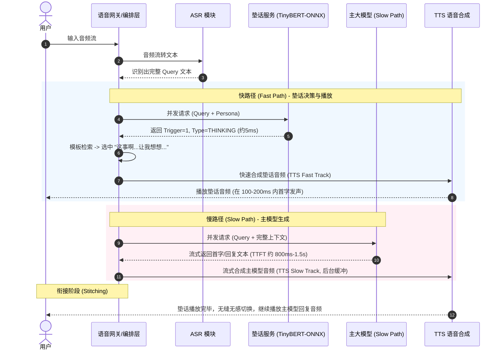

# 极轻量高并发“垫话/过渡词模型”需求与架构设计方案

在实时语音交互（如语音助手、智能客服、实时对话数字人）场景中，主大语言模型（Main LLM）的首字延迟（TTFT, Time to First Token）通常在数百毫秒至数秒之间，这会导致用户在说话结束后感到明显的停顿与迟钝。

为了消除这种“尴尬的沉默”，本项目拟构建一个**极轻量、高并发的“垫话/过渡词模型”（Filler Words Model）**。当用户结束说话后，该模型在数毫秒内做出决策，即时输出符合当前意图与助理角色设定的垫话，并即时通过 TTS 播放，以“欺骗”用户听觉，从而平滑对冲主模型的首字延迟。

---

## 1. 数据定义与数据工程

本着“极轻量、低延迟”的原则，模型的数据流和输入输出进行如下精简设计。

### 1.1 输入数据定义
模型推理阶段仅依赖两个核心输入，**不依赖历史上下文和声学特征**：
1.  **当前用户 Query 文本**：ASR（语音识别）实时输出的完整文本（例如："你觉得人工智能未来会毁灭人类吗？"）。
2.  **助理角色分类标签（Persona Tag）**：当前系统配置的 AI 助理属性，属于静态配置传入。例如：
    *   `male_white_collar`（中年男白领）
    *   `female_receptionist`（前台女助理）
    *   `grandpa`（老爷爷）
    *   `young_girl`（女童）

### 1.2 输出数据定义
模型不直接生成复杂的垫话文本（直接生成会增加模型体积与推理延迟，且难以控制幻觉），而是输出**结构化标签**：
1.  **触发决策（Trigger Decision）**：是否触发垫话。
    *   `0`: 不触发（例如简单 Query "一加一等于几" 或 "好得"，这类问题需要直接快速回答，垫话会显得愚蠢）。
    *   `1`: 触发（例如复杂问题、开放性讨论，需要主模型思考较长时间）。
2.  **垫话类别（Filler Type）**：若触发，预测最合适的垫话类型。
    *   `THINKING`（思考延迟型）
    *   `AGREE`（认同倾听型）
    *   `EMPATHY`（共情型）
    *   `TRANSITION`（过渡结构型）

预测出 `Filler Type` 后，结合 `Persona Tag`，通过**静态配置字典（Templates Registry）**随机抽取对应的具体话术：

| 助理角色 (`Persona Tag`) | 垫话类别 (`Filler Type`) | 候选垫话话术示例 |
| :--- | :--- | :--- |
| `grandpa` (老爷爷) | `THINKING` | "这事啊...让我想想..."；"嗯...我想一想哈..." |
| `young_girl` (女童) | `THINKING` | "嗯...我想想看哦！"；"让我想一下下哈~" |
| `female_receptionist` | `AGREE` | "好的，明白您的意思了。"；"好的，我了解了。" |
| `male_white_collar` | `TRANSITION` | "关于这个问题，实际上..."；"这个问题，我们可以这样看..." |

### 1.3 数据集建设与语料合成
为了训练分类模型，需要构建包含 `(Query, Persona, Trigger_Label, Type_Label)` 的数据集。
*   **语料来源**：
    *   收集现有的高频用户问题列表（常见 QA 集、闲聊数据集、任务型对话数据集）。
*   **LLM 标注与合成方案**：
    *   使用具有 OpenAI 兼容接口的商业或开源大模型（如 GPT-4o、Qwen-Max），编写 Prompt 对现有问题进行批量标注。
    *   **Prompt 任务一（分类）**：判断 Query 是否属于复杂/开放式问题（是否触发垫话），并判断最适用的垫话类型（`THINKING`/`AGREE`/`EMPATHY`/`TRANSITION`）。
    *   **Prompt 任务二（增强）**：对高频问题进行同义改写（Paraphrasing），扩展文本泛化能力。
    *   **Template 生成**：让大模型根据四种不同的 Persona 设定，分别撰写各 50+ 条的各类垫话模板，存入系统配置。

---

## 2. 模型选型评估

针对高并发、极低延迟的要求，我们对以下两种方案进行评估：

| 评估维度 | 方案 B: 轻量级文本分类器 (FastText / TextCNN) | 方案 C: 蒸馏小 Transformer (TinyBERT / MiniLM ONNX) |
| :--- | :--- | :--- |
| **推理延迟 (CPU)** | **极佳 (1 ~ 3 ms)** | **优秀 (3 ~ 8 ms)** |
| **模型体积** | 极小 (< 5MB) | 较小 (15MB ~ 50MB) |
| **语义理解与泛化能力** | 较差（极度依赖字词精确匹配，同义词泛化差） | **极佳**（具备深层语义表征，能理解未见过的相似问法） |
| **角色特征融合难度** | 较难（需要将 Persona 转化为 one-hot 向量与池化层拼接） | **极易**（可将 Persona 直接作为 Prompt 前缀，或通过文本拼接一同输入） |
| **高并发部署** | 极高并发，资源开销极小 | 高并发，在 ONNX Runtime 优化下开销可控 |

### 🔍 最终选型决策：**方案 C（TinyBERT / MiniLM-L6 的 ONNX 部署方案）**
*   **决策理由**：垫话模型对“是否需要思考（触发决策）”的判定需要较强的语义感知能力。例如，"苹果怎么吃"（简单 factual）与 "怎么评价苹果公司的发展"（复杂开放）虽然字面重合度高，但处理逻辑完全不同，FastText 极易误判。
*   **推荐规格**：选择 2 层或 4 层的蒸馏 Transformer 模型（如 `bert-tiny`：2 层，128 隐藏层维度，约 440 万参数）。将其转换为 **ONNX 格式**，在 CPU 上即可稳定实现单次推理 <5ms 的极速响应。

---

## 3. 特征工程设计

为了保证端到端极速响应，特征工程需进行极致剪裁。

### 3.1 文本特征与 Persona 特征融合
不进行繁琐的分词、词性标注等前置 CPU 密集型操作，而是直接利用模型的 Tokenizer 进行处理：
*   **特征融合方案（Prompt Prefix 模式）**：
    将 `Persona Tag` 作为特殊的前缀前置到 Query 文本中，一同送入 Tokenizer。
    *   *拼接格式*：`[Persona] + "助理角色" + [SEP] + "用户Query"`
    *   *示例*：`[Persona] 老爷爷 [SEP] 为什么天是蓝色的？`
    *   模型通过端到端训练，自动学习在“老爷爷”角色下，遇到此类 Query 是否触发垫话，以及触发何种类型的垫话。

### 3.2 排除的特征说明
*   **无声学特征**：不引入 VAD 停顿时间、说话人语速、音量波动等声学特征，避免前置音频解析带来的延迟，且降低系统复杂度。

---

## 4. 落地架构与工程设计

### 4.1 双路并发执行（Dual-Stream Execution）
系统采用双路并发设计，将“延迟敏感路径”与“计算敏感路径”剥离：

### 4.2 平滑衔接机制 (Stitching & Interruption)
项目采用 **“策略 A (完整播放)”** 作为衔接方案：
1.  **垫话时长控制**：模板库中所有配置的垫话文本长度应控制在 5~8 个字内，经 TTS 合成后的播放时长严格控制在 **1.0s ~ 1.5s** 之间。
2.  **静默拼接流**：
    *   在垫话 TTS 播放期间，主 LLM 的流式输出在后台并行进行 TTS 合成，并将合成后的音频帧放入缓冲区（Buffer）。
    *   音频播放器（Client/Gateway Audio Mixer）在**垫话音频流自然播放结束时**，立即拉取缓冲区中的主模型音频流进行无缝拼接播放。
    *   **优势**：避免了突然打断音频导致的刺耳爆音或用户听觉上的突兀感，交互体验极其自然平滑。

### 4.3 高并发与低延迟部署架构
1.  **引擎选择**：垫话模型使用 **ONNX Runtime (CPU)** 或 **TensorRT (GPU)** 导出并运行。
2.  **服务部署**：
    *   垫话服务独立部署为微服务，或作为 Sidecar 容器与语音编排网关（Gateway）同机部署。
    *   网关与垫话服务之间采用高性能 **gRPC** 或本地 **Unix Domain Socket** 通信，通信延迟控制在 1ms 以内。
3.  **缓存设计 (Caching)**：
    *   对高频高重复性 Query（如"你好"、"再见"、"你是谁"）建立内存級 KV 缓存。命中缓存时推理延迟降为 0ms。
